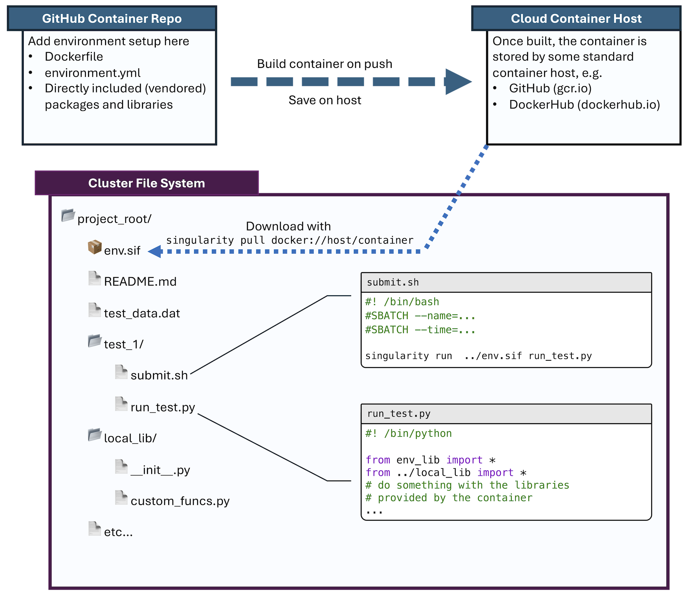
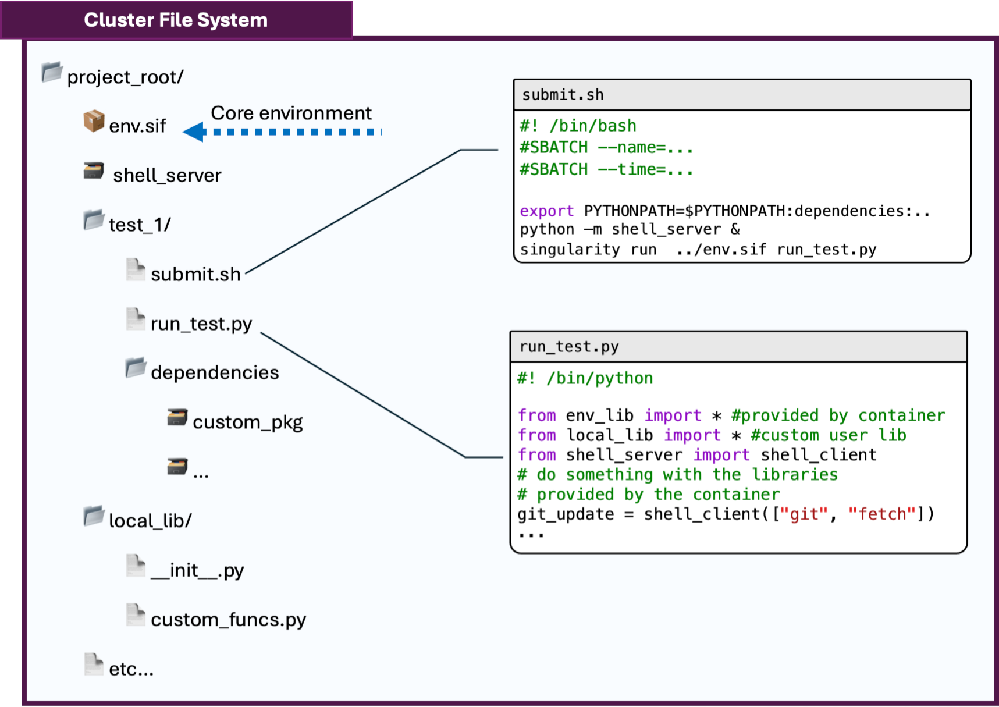

# singularity-demo

A demo container environment that can serve as an example for how to build python projects in a way that is easy to share.
We create a [Singularity](https://docs.sylabs.io/guides/latest/user-guide/) container that is pre-built to encapsulate
the environment necessary to run the package.
In doing so, users of our code just need to download the container on their system, and no conflicting conda environment
or complicated build processes need to be dealt with.

To make the process as generic as possible, we build off of a base conda environment (`environment.yml`), but this is not necessary.

The package code itself is included in the container, although there is no reason it has to be.
If the package is in a development stage, it usually makes sense _not_ to include it, as then the container
doesn't need to be rebuilt every time.
To handle that workflow, it is possible to tell Singularity to make other directories on the cluster file system accessible to scripts.
This is discussed more later.

The container itself is automatically built and pushed to the [GitHub container registry](https://ghcr.io) 
using the [GitHub action](https://github.com/features/actions) defined in `.github/workflows/docker-publish.yml`
and can be downloaded onto the cluster on which it will be used via

```commandline
singularity pull env.sif docker://ghcr.io/tabor-research-group/singularity-demo:latest
```

> [!TIP]
> It usually makes sense to redirect where Singularity stores its cache files to a scratch directory
> so your `pull` command might look more like

```commandline
username="$(whoami)"
export SINGULARITY_CACHEDIR="/scratch/user/$username/.singularity/cache"
singularity pull env.sif docker://ghcr.io/tabor-research-group/singularity-demo:latest
```

The basic flowchart for this process looks like this

</img>


## Custom Packages

As alluded to above, it is often the case that we have some custom code we are using in parallel with the environment and packages provided by the container.
To avoid having to rebuild the container every time we tweak the code, we will make our custom packages available in the container at runtime.
In the simplest case, this is simply a matter of setting up our active directory to look like

```
your_root/
├── env.sif
├── your_project/
│   ├── run.py
│   ├── submit.sh
│   ├── data.data
│   ├── dependencies/
│   │   ├── custom_package/
│   │   └── ...
│   └── ...
└── ...
```

and then starting in `your_project` calling

```commandline
singularity run ../env.sif python run.py
```

will make the `dependencies` folder immediately searchable.

In the case of shared dependencies, the setup looks like

```
your_root/
├── env.sif
├── your_project/
│   ├── run.py
│   ├── submit.sh
│   ├── data.data
├── dependencies/
├── custom_package/
│   └── ...
└── ...
```

and to make the same dependencies available, we need to map them in at runtime by calling the container like

```commandline
export PYTHONPATH=dependencies
singularity run ../env.sif -B ..dependencies:dependencies python run.py
```

where the `-B src:target` option maps a path (`src`) from the host file system to the specfied path (`target`) in the container. The `export` call makes sure the `PYTHONPATH` is set up correctly inside the container.


## Jupyter Notebook Integration

It is possible to set up Jupyter notebooks to run with a container-based python kernel, as long as `ipykernel` is installed in the container.
If it is not, it may be included using `pip install --target=...` following the custom package discussion above. 
To use a Singularity container as a kernel, we simply need to create a custom kernel wherever Jupyter searches for kernels (usually `~/.local/share/jupyter` on Linux machines).
Creating a custom kernel folder, we simply edit the `kernel.json` file to look like

```json
{
    "argv": [
        "singularity",
        "run",
        "/path/to/your/container.sif",
        "python",
        "-m",
        "ipykernel"
    ],
    ...
}
```

Now you can choose this as your active kernel from the Jupyter kernel drop down menu.
Note that more arguments may be added to customize what directories the kernel has available.

## Handling Job Resubmission and GitHub integrations

A container provides an isolated execution environment.
While this means code written on one machine will be execute equivalently on a different one, it also means we can't naturally use things like `git` and `sbatch` on the host file system.
To get around this, we can take a page from web-based workflows and communicate from the container to the external environment through a client/server architecture.
Python makes this very easy, and we've included an example of a TCP/IP socket infrastructure similar to that used by web browsers which allows a user to call into restricted subsets of external file system commands.

The only requirement with these types of workflows is to ensure that the server is started before the client and that the server port is accessible inside the container.
This means our call turns into

```commandline
export SHELL_SERVER_PORT=9999 # often good to randomize
python -m shell_server & # start the server in the background
singularity run ../env.sif python run.py
```

and inside `run.py` we will use the `client` portion of the `shell_server` library to run our `git` and `sbatch` workflows

This workflow is depicted in


</img>


## Custom Conda environments

Very, very rarely it is useful to have a separate conda environment than the one inside the container.
In this case we can adapt the custom package flow above to use the `--prefix` argument with `conda` to redirect to custom file system paths in the container.