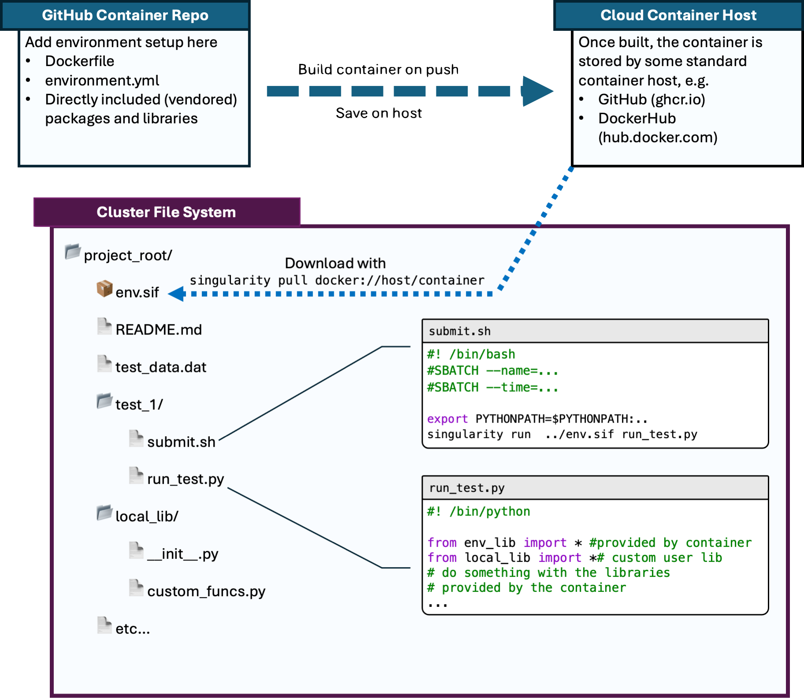

# singularity-demo

A demo container environment that can serve as an example for how to build python projects in a way that is easy to share.
We create a [Singularity](https://docs.sylabs.io/guides/latest/user-guide/) container that is pre-built to encapsulate
the environment necessary to run the package.
In doing so, users of our code just need to download the container on their system, and no conflicting conda environment
or complicated build processes need to be dealt with.

To make the process as generic as possible, we build off of a base conda environment (`environment.yml`), but this is not necessary.

The package code itself is included in the container, although there is no reason it has to be.
If the package is in a development stage, it usually makes sense _not_ to include it, as then the container
doesn't need to be rebuilt every time.

The container itself is automatically built and pushed to the [GitHub container registry](https://ghcr.io) 
using the [GitHub action](https://github.com/features/actions) defined in `.github/workflows/docker-publish.yml`
and can be downloaded onto the cluster on which it will be used via

```commandline
singularity pull env.sif docker://ghcr.io/tabor-research-group/singularity-demo:latest
```

> [!TIP]
> It usually makes sense to redirect where Singularity stores its cache files to a scratch directory
> so your `pull` command might look more like

```commandline
username="$(whoami)"
export SINGULARITY_CACHEDIR="/scratch/user/$username/.singularity/cache"
singularity pull env.sif docker://ghcr.io/tabor-research-group/singularity-demo:latest
```

The flowchart for this process looks like this

</img>